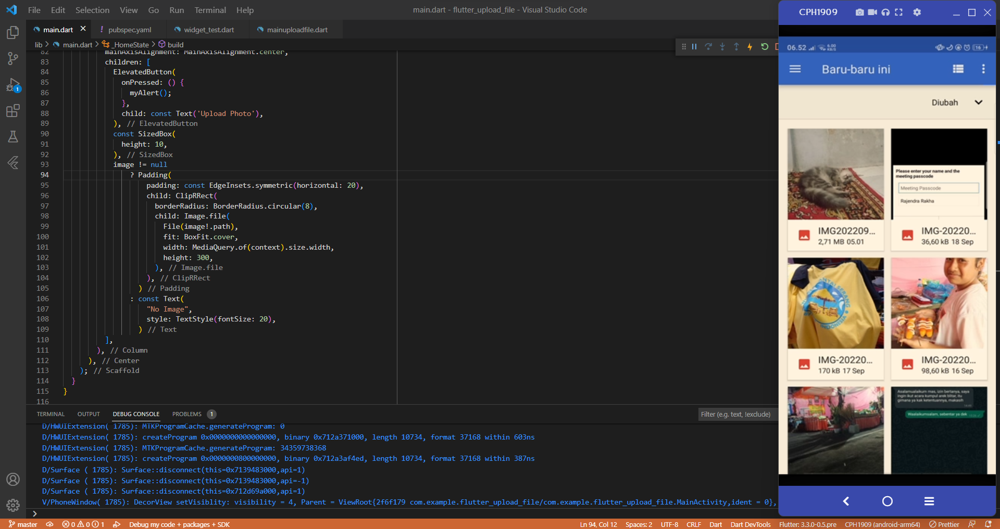

# flutter_upload_file

Praktikum Upload File dan Play Video

## Upload File

- Menampilkan button untuk melakukan upload file

- Menampilkan pilihan media untuk melakukan upload file

- Tampilan saat mengakses folder untuk melakukan upload file

- Tampilan saat user sudah melakukan upload file

- Apabila memilih media camera, maka akan menjalankan camera

## Play Video

- Menampilkan Video yang akan di jalankan, pada bagian kanan bawah terdapat tombol play dan pause untuk menjalankannya.

- Tampilan saat video di jalankan
